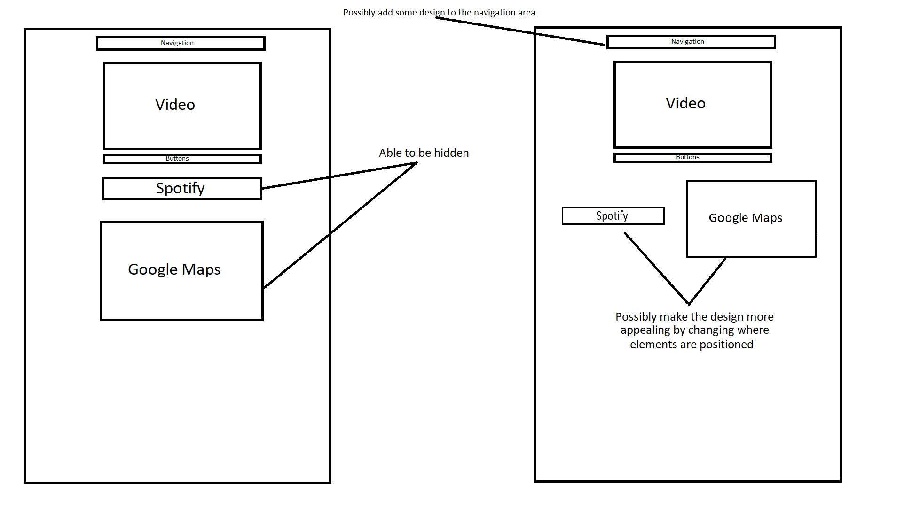
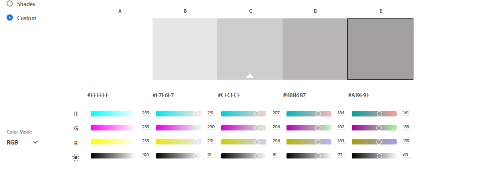

## Aesthetic and Minimalist Design ##
I would like for the site to have a good design that has flow to it. Currently everything is just centered in the page (because it's still a work in progress) and the user needs to scroll to see everything. In the future I would like to remove or minimalize the need for scrolling.

## User Control and Freedom ##
By the end of the project I would like to add the ability for users to remove/hide things that they do not want to see on the page. For example, if the user doesn't want to see the Spoify or Google Maps portion of the page, they can click a button to hide them. I think this would be a convenient feature.

## Color Scheme ##
I chose a color scheme of a gradient from white to grey. This color scheme will hopefully bring the thought of snow and mountains/rock to mind. In my opinion, it also is a pleasant and clean looking color scheme.

## Font ##
The font I will be using is Arial. I am choosing this font because it is easy to read and is one of the default fonts accessible to all browsers. Also, this font reminded me of reading snowboard magazines.

## Examples ##
- 
- 