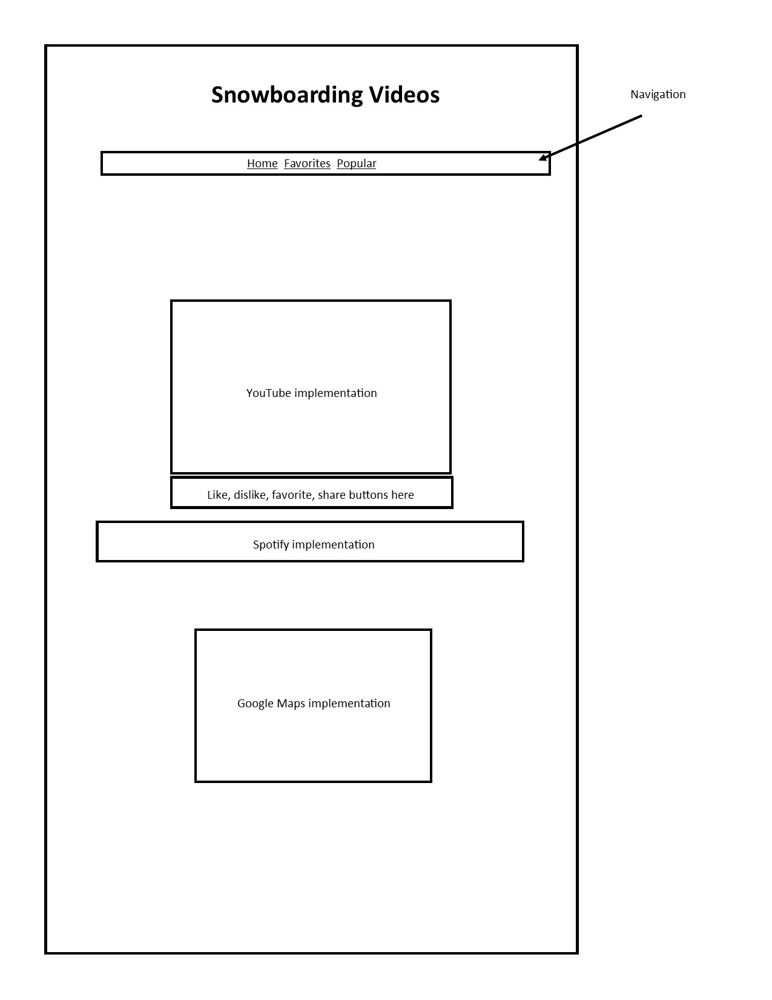
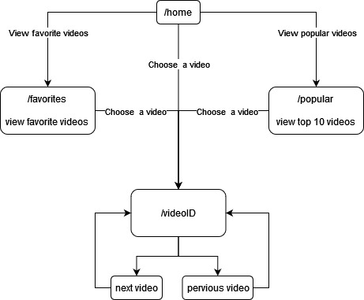
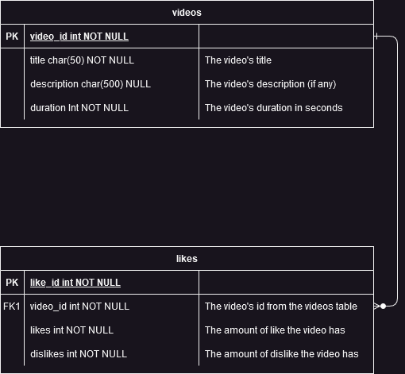

# ShredTube #
ShredTube is a site that has snowboarding videos to watch.
Users can like, dislike, favorite, and share each video.
Under each video there is a Spotify implementation to find
the music used in the video. There is also a Google Maps
implementaion that will show a location the video was filmed.

## Web Services ##
- [YouTube](https://developers.google.com/youtube/ "OAuth 2.0")
- [Spotify](https://developer.spotify.com/documentation/web-api/ "API Key")
- [Google Maps](https://developers.google.com/maps/ "OAuth 2.0")

## Database Use ##
The database will be used to record likes and dislikes
for each video to display which ones are popular.
Two tables will be needed: **videos** with the video's information, 
and **likes** for the amount of likes it received.

## Initial Designs ##
- 
- 
- 